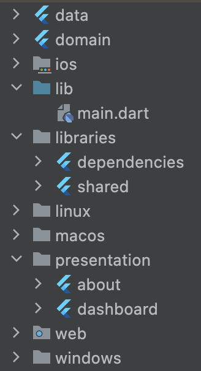

# frestauran_modulars

Restaurant App with Modulars

### Module Structure


### How to run build_runner for all module
I use ```melos.yaml``` to help to do this

So, following these command
```dart
 root project folder > melos run generate:flutter 
```